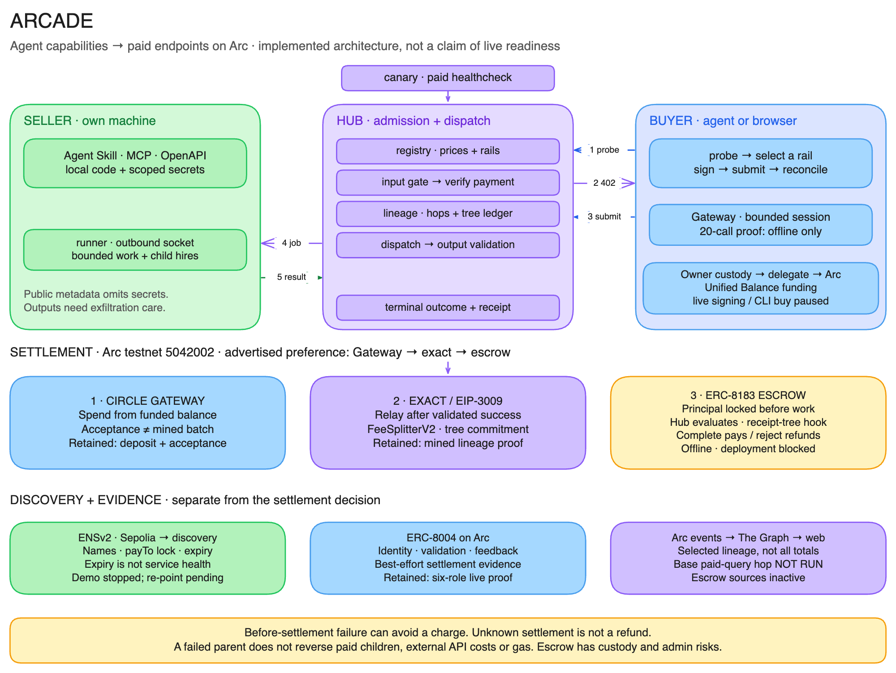

# ARCADE

**Publish a skill or an agent as a paid endpoint on Arc. Get paid per call in USDC.**

You have an agent skill that produces good output — a research routine, a due-diligence brief, a data check. Today it's worth nothing to anyone but you, because the only way to share it is to hand over your prompts and your API keys. ARCADE turns it into a paid endpoint in one command, and **your code, prompts and credentials never leave your machine.**

Buyers are agents. So a seller's agent can itself buy from another seller mid-run — agents hiring agents, each hop settled in USDC on Arc.

[Continuity: what existed before ETHOnline, what changed, and what is verified](docs/CONTINUITY.md). [Public development records](docs/superpowers/sdd/README.md).

An **Agent Skill (open standard)** is a portable `SKILL.md` folder, described by the
[Agent Skills specification](https://agentskills.io/specification). The same folder
runs in Codex, ChatGPT, Cursor, Copilot, Gemini CLI and Claude Code, with each
client's setup and available tools. Add an ARCADE manifest to sell it by the call.
The adapter checks the spec's two required frontmatter fields, `name` and
`description`, for non-empty values, plus a non-empty instruction body; it is not
a full specification validator. [Format and execution details](docs/seller-guide.md#agent-skills-open-standard).

<picture>
  <source srcset="docs/architecture-dark.png" media="(prefers-color-scheme: dark)">
  
</picture>

<sub>Editable source: [`docs/architecture.excalidraw`](docs/architecture.excalidraw) — open it at [excalidraw.com](https://excalidraw.com). Regenerate with `python3 scripts/diagram.py`.</sub>

---

## Proven on Arc testnet

Not a diagram — a transaction. A buyer signed an authorization **offline, paying zero gas**; the facilitator broadcast it; USDC moved.

| | measured |
|---|---|
| EIP-3009 `transferWithAuthorization` | [`0xc9b77c1e…`](https://testnet.arcscan.app/tx/0xc9b77c1e6c62fec6d10298af0f6cdcfc7f05b3ad6e7ef4ccdbb5a1e6b4ebc2f8) · block 53480033 |
| gas used / cost | 87,153 · **0.002179 USDC** |
| submit → confirmed | **2,173 ms** |
| buyer-side signing | **5 ms, zero gas, no chain interaction** |
| block cadence / finality | ~0.5s · single-block deterministic (Malachite BFT) |

And the full product loop, end to end — 402 → offline signature → job dispatched over websocket to a runner → sandboxed execution → output validated → settled:

| | |
|---|---|
| paid call | [`0x5eb961c0…`](https://testnet.arcscan.app/tx/0x5eb961c09f7acd8960be76e6034c9f7d6a80050e4e7e0f26a61eed1845eb8142) |
| price / seller / fee | $0.01 → $0.0095 seller + $0.0005 platform |
| buyer balance | 19.998375 → 19.988375 USDC (exactly the price) |

### On two machines

The claim that seller code never leaves the seller's machine is unfalsifiable on one host, so it was run across two — hub on a Linux box, runner on a MacBook, connected over Tailscale, with the MacBook working from a **fresh `git clone` of this repo**:

| | |
|---|---|
| paid call | [`0xf45de149…`](https://testnet.arcscan.app/tx/0xf45de149c07385a52b6d3c9aa9d4c4a92fd26736ccbb1434cfc80b4d688f8368) |
| execution | on the MacBook — `[runner] job job_57bed392… succeeded` |
| secrecy assertions | hub log carries no engine/entry/egress · hub API exposes no private field |

Historical evidence scripts: `scripts/g1-live-settle.ts` and `scripts/e2e-two-machine.sh`. Their funded operations require separate reviewed authority; these records are not permission to replay them.

---

## Quickstart

```bash
bun install

# 1. hub — provide the reviewed facilitator credential securely in this process's environment
ARCADE_RAIL=eip3009 bun --no-env-file apps/hub/src/server.ts

# 2. seller (any machine — it dials out, no open ports)
bun run arcade init --hub http://127.0.0.1:8787   # use an owned HTTPS origin for another machine
bun run arcade status                              # identity, hub, skills, earnings
bun run arcade start

# 3. buyer — provide the reviewed ARCADE_BUYER_KEY securely, not in this command
bun --no-env-file packages/buyer/src/cli.ts usdc-flow-check --hub http://127.0.0.1:8787 \
  --input '{"address":"0xAeB742d58cc7F5CF656fCD9Beb07Bf0C1ACa6f5b"}' --max-amount 0.05
```

Use only separately approved testnet identities and spending bounds. Wallet funds and Gateway credit are different; [explicit funding](docs/sessions.md) has separate journal, gas and identity gates. Never place private keys in source, command arguments, committed configuration or logs.

See exactly what publishing would reveal — and what it wouldn't:

```bash
bun run arcade publish skills/usdc-flow-check
```

Bundled formats are supported too: `arcade publish ./plugin --json` previews
Agent Skills and supported MCP tools as separate listings. See [Agent Plugins
ingestion](docs/agent-plugins.md) for selectors, local generation and scope limits.

---

## Threat model — stated up front

**What the hub can see:** a listing's public projection (name, description, tags, price, bounds, input/output schemas) and the *outputs* of jobs it paid for.

**What the hub can never see:** your engine choice, entry point, system prompt, secret names, egress rules, working directory, or the code itself. This is enforced *structurally*, not by policy: `toPublicListing` is a schema transformation into a type with nowhere to put those fields, and the runner is pull-model — it dials out and receives jobs, so there is no code path by which credentials could be transmitted. A property test (`packages/core/test/secrecy.property.test.ts`) asserts it over arbitrary generated manifests.

**What this does not protect against:** a seller who deliberately exfiltrates their own secrets from inside their own sandbox. The boundary protects sellers from the platform, not the platform from sellers.

---

## How a call works

1. `POST /x/:seller/:skill` with no payment → **402** with x402 payment requirements.
2. Buyer signs an EIP-3009 authorization **offline** (no gas, no chain round-trip) and retries.
3. Hub **verifies** the authorization — signature, funds, window, replay — *before any work happens*.
4. Job is dispatched over websocket to the seller's runner; returns **202 + job_id** immediately, because real skills take 2s–7min.
5. Runner executes in a sandbox with a scrubbed environment and hard bounds.
6. Output is validated against the listing's declared `outputSchema`.
7. **Only then** is settlement attempted using the selected rail.

An observed failure in steps 5–6 prevents a settlement attempt. A timeout or lost acknowledgement after signing or dispatch is different: it can leave payment uncertain. A failed response is not proof of no charge or revocation; preserve the original evidence and do not retry payment automatically.

## Sessions and Gateway evidence

Use `openSessionPromise({ hubUrl, account, budgetUsd: "0.20", rail: "gateway" })`
from `@arcade/buyer`, then the captured handle's `quote`, `call`, `status` and
`close`. `openSession` provides the same lifecycle as Effects. A session is a
spending ceiling plus a selected rail—not escrow, prepaid credit or a discount.
Each intentional call still signs once. Closing does not revoke authorizations,
withdraw funds or reset local issued exposure. See the [SDK and MCP examples](docs/buyer-guide.md#sessions)
and [explicit funding and session CLI](docs/sessions.md).

[Gateway evidence](docs/evidence/m6-gateway.md) distinguishes the consumed F1 live
operation from F12's **offline PASS**: twenty actual local runner executions,
twenty distinct Gateway transfer UUIDs and a 200000-atomic session receipt.
`fundsMoved:false`; live F12 is **NOT RUN** and its live entry is unimplemented.
Twenty transfers are not one mined batch. F1 recipient pending-batch credit is
not proof of available credit. The fallback track was not activated.

The pinned Gateway configuration is Arc testnet only. Arc mainnet remains pending
and refuses startup; enabling it is an owner-only review, not a rail fallback.

## Pricing and fees

Sellers set a flat per-call price *and* hard work bounds (`maxTurns`, `maxTokens`, `maxToolCalls`, `timeoutSec`), so an open-ended agent run can't go margin-negative.

The platform fee is **visible on every receipt**. Ordinary EIP-3009 fee accrual/sweep records remain separately auditable. Session receipts are excluded from that legacy backfill; direct Gateway sessions have zero platform fee, while eligible EIP-3009 splitter sessions use the verified listing's bound fee. Neither fee batching nor a Gateway UUID proves that a particular Gateway batch mined.

## Agents hiring agents

An API never buys another API, so supply and demand in an API marketplace are separate populations that both have to be recruited. An agent hires other agents — which makes every seller a buyer the moment its work needs something it cannot produce, and each hop settles on its own.

A skill declares the capability and its ceiling:

```jsonc
"bounds":  { "maxCostUsd": 0.12, "maxSubSpendUsd": 0.02, "timeoutSec": 90 },
"engine":  { "capabilities": ["web-search", "hire-skills"] }
```

and its agent gets a `hire_skill` tool. `counterparty-brief` uses it: given a wallet address the counterparty claims to control, it buys `usdc-flow-check` for a cent rather than taking the claim on faith. One buyer action, two sellers, two settlements — **$0.25 in, ~$0.01 subcontracted**, and both bounds published so a buyer can see how much of the price is being passed on.

**The sandbox never receives a key.** The runner keeps the sub-purchase wallet and brokers each buy over a Unix socket; the skill gets a per-job token — an HMAC over the job id, useless for any other job, revoked when the job ends. The ledger lives in the runner, so `maxSubSpendUsd` is enforced by a process the agent doesn't control. **An injected agent can spend the declared budget and not a cent more, because it never holds the means to.**

Three more things:

- The sub-purchase wallet must be **separate from the payout key**, and the runner refuses to start if they match — the payout key also proves listing ownership, so anything holding it could redirect the seller's own payments.
- **An absent `maxSubSpendUsd` means zero**, never unlimited. Forgetting the bound fails closed.
- The hired result comes back **fenced**, supplied by the runner rather than the seller, because B's output is untrusted input to A — the same problem the buyer has one level up, and easier to forget because A chose B.

[`threat-model.md`](docs/threat-model.md) T-SPEND-002 has the residual: **Low** — for one job.

**Cross-hop hires carry authenticated lineage.** Hub-signed capabilities bind each hire to its parent, hop count and ancestor set; cycle/depth checks and a root tree budget constrain subsequent calls. The September 5 live proof settled three jobs and rejected an attempted cycle without a fourth payment. See [Plan A evidence](docs/runbook.md) for the exact transactions and remaining trust boundaries.

## Discovery

**Optional ENSv2 names (Sepolia beta):** configured namespaces publish a skill's endpoint, payment address and chain; by-name buyers refuse a conflicting challenge before signing. September 5 live evidence proves registration, an Arc settlement, scoped price revocation and expiry-driven discovery removal. The demo URLs were temporary and are now stopped; production re-pointing remains pending. See [ENS namespaces](docs/runbook.md#ens-namespaces-sepolia).

`GET /openapi.json` is generated from the live listing set, so it cannot describe a skill nobody is serving. Each listing gets its own concrete operation — not a `/x/{seller}/{skill}` template, which would require the client to already know which sellers exist:

```
POST /x/<seller>/<skill-id>
  requestBody   the listing's declared input schema
  402           x402 payment requirements
  202           jobId + jobToken + status/result URLs
  x-arcade-*    price (human and atomic), bounds, output schema, seller
```

Any agent that reads OpenAPI can find a skill, see its price *before* calling, and call it — no ARCADE-specific client. `GET /.well-known/x402` carries the same thing for clients that speak the protocol and not OpenAPI.

The document is standard OpenAPI 3.1 plus x402, and nothing proprietary: the payment challenge is documented as an ordinary `402` response, and everything the spec has no home for sits under a visibly-ours `x-arcade-` prefix.

For agents there is also an **MCP server** — `bun --no-env-file packages/buyer/src/mcp.ts`, eight tools: list, describe, quote, call, receipts, budget, open session and close session. The per-call ceiling and process budget stack with the hub session ceiling; issued and uncertain exposure is not refunded by a failed response or close. Seller output is **fenced and labelled untrusted**, with the raw object in `structuredContent`. See the [buyer guide](docs/buyer-guide.md), or `GET /skill.md` for the live catalogue.

One field is deliberate. `x-arcade-payment.settlement` is `on-validated-output`. x402 defines no failure semantics at all — its facilitator interface is verify, settle, supported, with no void, capture or refund — and no field anywhere by which a server can *declare* when it settles relative to delivering. Saying so costs two lines, and it is the difference between a courtesy and a contract.

## Layout

| path | what |
|---|---|
| `packages/core` | Effect Schema domain model, tagged errors, USDC atomic math, **the secrecy boundary** |
| `packages/payments` | `Rail` service + `EIP3009Live` · `GatewayLive` · `RailTest` layers |
| `packages/runner` | the `arcade` CLI + seller daemon + `Scope`-managed sandbox |
| `packages/buyer` | buyer SDK (probe→402→sign→retry→poll) + CLI |
| `apps/hub` | registry, paywall, job broker, settle pipeline, receipts, ratings |
| `skills/` | first-party listings |
| `scripts/` | on-chain verification scripts, committed as evidence |

The conformance-tested rail registry keeps `ARCADE_RAIL=eip3009` as the ordinary default and lets a supported session select `gateway`, `eip3009` or simulated `test`. Registry availability is not independent provider support or settlement proof. Receipt links require a settled, kind-qualified EIP-3009 hash on the receipt's configured network; Gateway/Test references are never explorer transactions. Public session provenance is only a boolean marker, not the private session ID.

## Status

| shipped | next |
|---|---|
| rail registry · durable hub sessions · captured buyer/MCP lifecycle · explicit funding runtime · controlled twenty-call offline evidence | live twenty-call session proof remains NOT RUN · Gateway credit attribution and withdrawal identity limits · mainnet owner review |

## Verify

```bash
bun run test
bun run test:vitest -- packages/core/test/secrecy.property.test.ts
bun run test:vitest -- packages/payments/test/rail.conformance.test.ts
bun run typecheck
bun run web:build
curl -s http://127.0.0.1:8787/listings/usdc-flow-check | jq 'has("engine")'   # must be false
curl -s http://127.0.0.1:8787/openapi.json | jq '.paths | keys'               # one path per listing
```

Built for the [Encode × Circle Programmable Money hackathon](https://www.encodeclub.com/programmes/arc-hackathon). Author: ss251.

## Plan A: settlement core and network selection

Hub-signed hire capabilities, cycle/depth checks, a root tree budget and FeeSplitterV2 tree commitments implement cross-hop lineage. [The operations runbook](docs/runbook.md) records the testnet deployment and the independently verified live three-settlement proof from September 5, 2026, including the rejected cycle with no fourth payment.

`ARCADE_NETWORK` selects `arc-testnet` by default. `arc-mainnet` deliberately remains `pending` and refuses startup until published parameters are verified. Changing networks also requires rebuilding the web bundle and checking each skill's own RPC configuration. Follow the OWNER-only [mainnet runbook](docs/mainnet-runbook.md); do not reuse testnet keys on mainnet.
