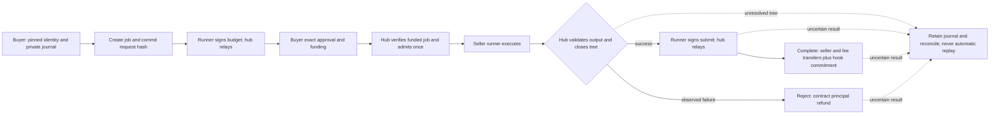
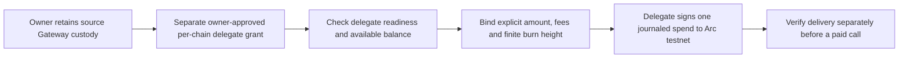

# Architecture

## The one-sentence version

A buyer agent pays per call in USDC on Arc; the seller's skill executes on the seller's own machine and the platform never receives the code, the prompts, or the credentials.

## Trust order

```
verify payment  →  execute in sandbox  →  validate output  →  settle
```

This ordering is the product's core guarantee in both directions:

- **Validation precedes settlement.** An observed refusal, timeout, bounds breach, empty result or schema mismatch before settlement prevents an attempt. A timeout or lost acknowledgement after issuing payment is uncertain, not proof of no charge; no automatic payment retry is safe.
- **Verification precedes work.** Signature, funds, validity-window and replay checks happen before dispatch. On the authorization rails this is not escrow or a guarantee that later settlement succeeds. The separately opt-in escrow path instead verifies already-funded on-chain job state before work; it is implemented offline, not deployed.

### Why this rules out Circle's Express middleware

`createGatewayMiddleware` settles the payment inside the HTTP request. Our jobs return `202 {job_id}` immediately and finish anywhere from two seconds to seven minutes later, so settlement must happen from a background fiber long after the response was sent. Express middleware structurally cannot express that. We therefore drive `verify()` / `settle()` directly — which is also what Circle's own documentation prescribes for production.

That decision is why the hub is `Bun.serve` + Effect rather than Express, and it removed the only reason Express was in the design.

## The secrecy boundary

`packages/core/src/manifest.ts` defines two projections of a seller's `arcade.json`:

| PublicListing (published) | SkillManifest (stays local) |
|---|---|
| id, version, serviceName, description, tags, iconUrl | `engine.adapter`, `engine.entry`, `engine.systemPrompt` |
| price, replaces, bounds | `secrets[]` (names only, never values) |
| inputSchema, outputSchema | `egress[]`, `workdir` |

`toPublicListing` **constructs** a `PublicListing` from named public fields. It is not a filter that deletes keys — the public type has nowhere to put a prompt or an entry path, so a future private field cannot leak by omission. Two mechanisms back this up:

1. `packages/core/test/secrecy.property.test.ts` generates arbitrary manifests stuffed with canary values and asserts none reach the wire.
2. The runner is **pull-model**: it opens an outbound websocket and receives jobs. There is no inbound connection and no code path that transmits manifest internals, so the guarantee is architectural rather than procedural.

## Rails

`Rail` is a `Context.Tag` service for the existing exact, Gateway and test paths.
Escrow has a dedicated payload/service contract and is not coerced into an
EIP-3009 authorization:

| layer | what |
|---|---|
| `EIP3009Live` | `transferWithAuthorization` on Arc USDC. Proven on-chain. Buyer signs offline (~5ms, zero gas); the facilitator broadcasts and pays ~0.00218 USDC. |
| `GatewayLive` | Pinned Arc-testnet Gateway authorization, local binding and signature checks, bounded facilitator verify/settle. Accepted per-call evidence is a Gateway transfer UUID, not a mined transaction or batch. |
| `RailTest` | Simulated in-memory balances and explicit test references; no real funds or mining. |
| `erc8183` (dedicated opt-in service) | Offline guarded root lifecycle, exact pinned deployment identity and durable action journals. Buyer funds before work; hub evaluates complete/reject. No usable deployment or live proof yet. |

The three ordinary rails share `packages/payments/test/rail.conformance.test.ts`;
escrow has its separate request/action/proof suites. Root challenges advertise
only built, listed, eligible choices in Gateway → exact → escrow order. The
buyer preference is an ordered allow-list, not permission to sign arbitrary
accepts or fall back after dispatch; Gateway needs observed available credit,
and escrow additionally needs explicit local deployment/gas/journal ownership.
Child hires retain their ordinary default and cannot become escrow children;
sessions keep their selected supported rail. Registry construction is not
provider liveness. The pending mainnet configuration still fails closed.

### Escrow and delegated funding delta (offline implementation)

These Mermaid sources describe implemented paths, not a live transaction trace.
Plan I will render the updated architecture; the existing README raster is not
evidence of this delta. Configuration/approval prerequisites remain in the
[escrow guide](erc8183-escrow.md) and [funding guide](unified-balance-funding.md).





The grant is continuing source authority, not a per-call cap or permission for
automatic deposits. SDK success alone is not independent delivery proof. J5 live
is paused at the existing signing/read deadline. Escrow deployment is blocked
by the oversized approved artifact plus the treasury checkpoint; its hub is an
admin-configured evaluator, not an immutable neutral verifier. Funding can incur
gas even if execution later fails; principal refund does not refund those costs.

### Durable sessions and evidence categories

F5's SQLite authority atomically admits a queued root and reserves its amount,
then atomically commits its terminal job/receipt and spent accounting. A one-shot
settlement barrier and nonce tombstones prevent local replay. Ambiguous execution
or payment retains held authority; it is not crash-proof remote-acceptance proof.
F6 delegates this authority without a second ledger. The F7/F8 routes require
private session headers, and result retrieval validates one persisted job/receipt
snapshot rather than combining unbound global reads.

The F9 buyer captures origin, account, chain, budget and signer authority. Intentional
calls issue once; repeated evaluation cannot pay again. Hub spent/held/remaining
and buyer issued/confirmed/exposure are distinct from wallet USDC or Gateway
available/pending credit. Close is neither withdrawal nor authorization revocation.
Session membership covers admitted roots only; seller-funded child hires remain
independent, sessionless calls. No session capability enters a hired sandbox.

Receipt presentation uses each receipt's network and kind, not the process default.
The generic link helper admits only settled EIP-3009 with a ready agreeing
manifest, nonzero full hash and legacy absent/onchain kind. The dedicated
public escrow view separately checks coherent Arc-root terminal metadata,
matching quoted/actual amounts, state and exact complete/refund URLs; it
rechecks props and labels all evidence as hub-reported. Its compact descendants
have no inherited escrow transaction links. Create/fund references are absent
from that public feed. Gateway UUIDs and TestRail references never become mined
explorer links. Public session provenance is a derived boolean; private session
IDs, capabilities and fallback job-handle aliases remain excluded.

[F12 offline evidence](./evidence/m6-gateway.md) used actual SDK, hub, SQLite,
Broker, WebSocket and runner execution with finite external fixtures: twenty
calls and twenty UUIDs, not one mined batch; fundsMoved:false, liveEvidence:NOT_RUN.
The live entry is unimplemented and F13 fallback was not triggered. The consumed
F1 live operation remains separately dated. [Funding](./sessions.md) is explicit
and separately journaled: deposit credit attribution is still pending, and the
current Minter identity mismatch refuses withdrawal before signing.

## Arc specifics that shape the code

- **USDC is both the native gas token (18 decimals) and an ERC-20 (6 decimals) at the same address** (`0x3600…0000`). Every price, payment and receipt in this codebase is 6-decimal atomic units; `packages/core/src/money.ts` speaks nothing else, and gas math is kept separate.
- **The public RPC rate-limits.** viem's default receipt polling triggers `-32011 request limit reached`. We poll one receipt per tick with exponential backoff and never use `waitForTransactionReceipt`.
- **The pinned Gateway signer uses a 604900-second expiry and ten-minute backdate**, matched to the reviewed SDK. This is a local interoperability policy, not proof that every future provider requires that window or accepts delayed submissions.
- **Circle's spending policies are mainnet-only**, so buyer-side caps (`--max-amount`) are ours.

## Discovery and the buyer surface

Three documents, all generated from the live listing set so none can advertise a skill nobody is serving:

| endpoint | for | contains |
|---|---|---|
| `/openapi.json` | any OpenAPI client | one concrete `POST /x/<seller>/<skill>` per listing, with input schema, documented `402`, and price in dollars and atomic units |
| `/.well-known/x402` | clients that speak the protocol and not OpenAPI | the same payment envelope the paid endpoints return |
| `/skill.md` | an agent's context | the catalogue as markdown, deliberately short because every line costs the reader |

`accepts[]` in the OpenAPI document is derived from the `PaymentRequirements` schema the rail itself constructs, not hand-written — the first live probe caught a hand-written version documenting `maxAmountRequired`, an x402 v1 field name this rail does not emit.

The buyer side has an **eight-tool MCP server** (`packages/buyer/src/mcp.ts`): list,
describe, quote, call, receipts, budget, open session and close session. Effect
Schemas describe and validate arguments. Its serialized queue captures the intended
lane/session handle, refusing stale work rather than rebinding it to a new session
or ordinary purchase. Per-call, process and hub ceilings stack; close/release never
erase issued exposure. Active-session quotes use the captured actual-input path
without signing; calls probe afresh. ENS-by-name and sandbox hire are not session
routes. See the [buyer guide](./buyer-guide.md#sessions) for actual SDK/MCP shapes.

## The chain

A skill declaring `hire-skills` gets `hire()` from `@arcade/buyer` inside its sandbox, surfaced to the model as a `hire_skill` tool the **runner** supplies — so the fencing of the hired result cannot be forgotten by a seller. Three variables are granted, none reachable through `secrets` because `ARCADE_` is a reserved prefix:

```
ARCADE_HIRE_SOCKET   the runner's broker socket
ARCADE_JOB_ID        which job is asking
ARCADE_JOB_TOKEN     HMAC(secret, jobId) — useless elsewhere, revoked at job end
```

**No key.** The runner holds the sub-purchase wallet and performs the buy; `packages/runner/src/hire-broker.ts` keeps the per-job ledger and enforces `maxSubSpendUsd`. The point is which process is bounded: an earlier version handed the key to the sandbox and checked the budget there, so the code holding the key was the code being limited, and the budget was advisory. Now the limit is enforced by a process the agent cannot reach. Both sides use `node:http` over a Unix socket rather than `Bun.serve`/`fetch({unix})`, so the enforcement path is identical under Bun and Node and is tested under both.

One buyer action can therefore produce several settlements: the buyer pays the parent skill, and the parent pays whoever it hired. Each hop is an independent x402 call with its own verification, its own validation and its own receipt — there is no nested-payment concept, which is what keeps it simple. Sub-spend is folded into the parent's reported `costUsd` so a receipt shows the seller's real margin, while `maxCostUsd` stays an inference bound and `maxSubSpendUsd` a hiring one.

Why it matters structurally: an API never buys another API, so an API marketplace has two populations to recruit. An agent marketplace has one — every seller is a buyer whenever its work needs something it cannot produce.

## Deviations from the plan

- **`Bun.serve` instead of `@effect/platform` HttpApi.** Runners need a real websocket server; Bun provides it natively with fewer moving parts, and all logic remains Effect. OpenAPI is still derived from the same Effect Schemas (`JSONSchema.make` at `/openapi.json`), so the discovery surface cannot drift from the domain model.
- **Server-rendered receipt fallback.** `apps/hub/src/ui.ts` remains the self-contained hub surface alongside `apps/web` (TanStack Start). Later web integration must preserve public field exclusions, explicit reference kinds and the boolean-only session marker.
